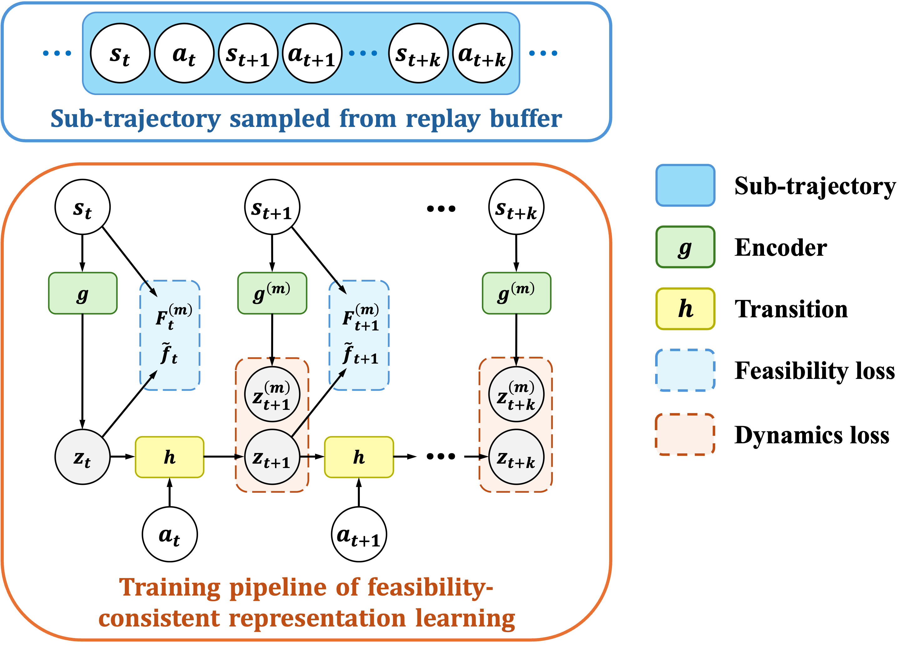

<br>
<p align="center">
<h1 align="center">
<strong>Feasibility Consistent Representation Learning for Safe Reinforcement Learning
</strong>
</h1>
</p>

<p align="center">
  <a href="https://arxiv.org/abs/2405.11718" target='_blank'>
    
  </a>
  <a href="https://sites.google.com/view/FCSRL" target='_blank'>
    
  </a>
</p>

## Overview
This repo provides an official implementation of *Feasibility Consistent Representation Learning for Safe Reinforcement Learning* (ICML 2024). In this paper, we propose a feasibility-based representation learning method to extract safety-related features and improve the safe reinforcement learning. Our method **FCSRL+TD3-Lag achieves SOTA (2024/02) performance on safety-gymnasium benchmark** among model-free safe RL algorithms. See [paper](https://arxiv.org/abs/2405.11718) for more details.

<p align="center">
    
</p>

## Installation
1) We recommend to use Anaconda or Miniconda to manage python environment.
2) Create conda env,
    ```shell
    cd FCSRL
    conda env create -f environment.yaml
    conda activate FCSRL
    ```
3) Install PyTorch according to your platform and cuda version.
4) Install FCSRL,
    ```shell
    pip install -e .
    ```

## Training
To run a single experiment, take `PointGoal1` for example, run
```shell
python scripts/{BASE_RL_ALG}_repr_CMDP.py --env_name SafetyPointGoal1Gymnasium-v0 --cudaid 0 --seed 100
```
where `{BASE_RL_ALG}` can be `ppo` or `td3`. For other task, you can simply replace `PointGoal1` and choose a task from `[PointGoal1, PointButton1, PointPush1, PointGoal2, CarGoal1, CarButton1]`. You can replace `--cudaid 0` to `--cudaid -1` to train with CPU.

For image-based task, 
```shell
python scripts/td3_repr_vision_CMDP.py --env_name SafetyPointGoal2Gymnasium-v0 --cudaid 0 --seed 100
```
If you need to train and render with CPU, you should modify the environment variable to 
```python
os.environ["MUJOCO_GL"] = "osmesa"
os.environ["PYOPENGL_PLATFORM"] = "osmesa"
```
in [script](scripts/td3_repr_vision_CMDP.py#L2). However, it can be very low if you train without GPU on image-based tasks.

## Citation

If you find our work helpful, please cite:

```bibtex
@article{cen2024feasibility,
  title={Feasibility Consistent Representation Learning for Safe Reinforcement Learning},
  author={Cen, Zhepeng and Yao, Yihang and Liu, Zuxin and Zhao, Ding},
  journal={arXiv preprint arXiv:2405.11718},
  year={2024}
}
```

## Acknowledgement
This repo is partly based on [Tianshou](https://github.com/thu-ml/tianshou).
